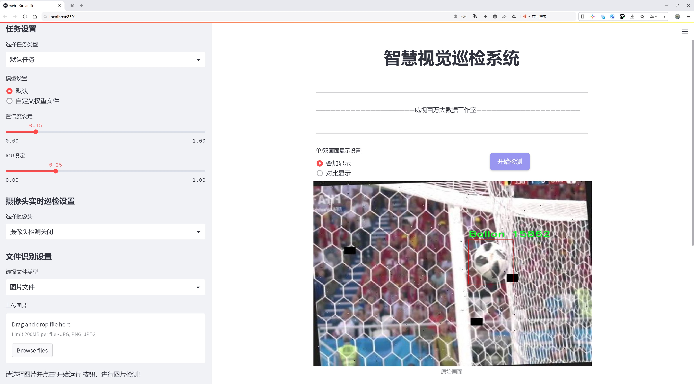
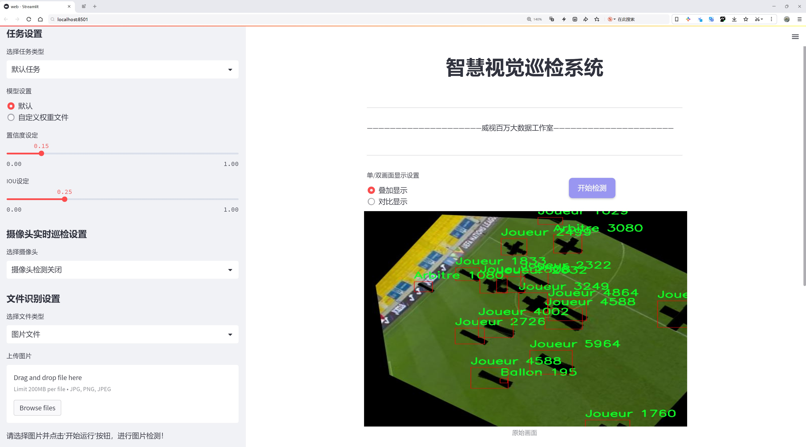
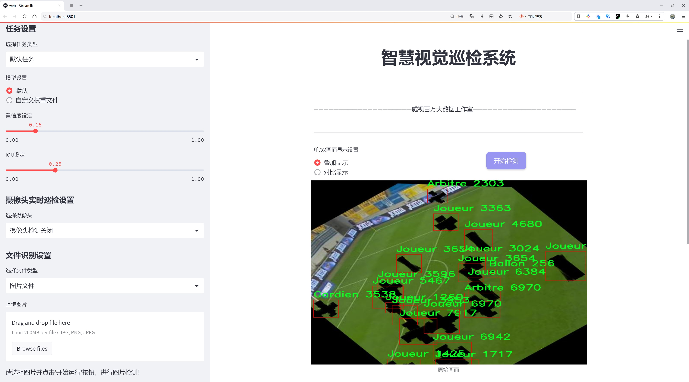
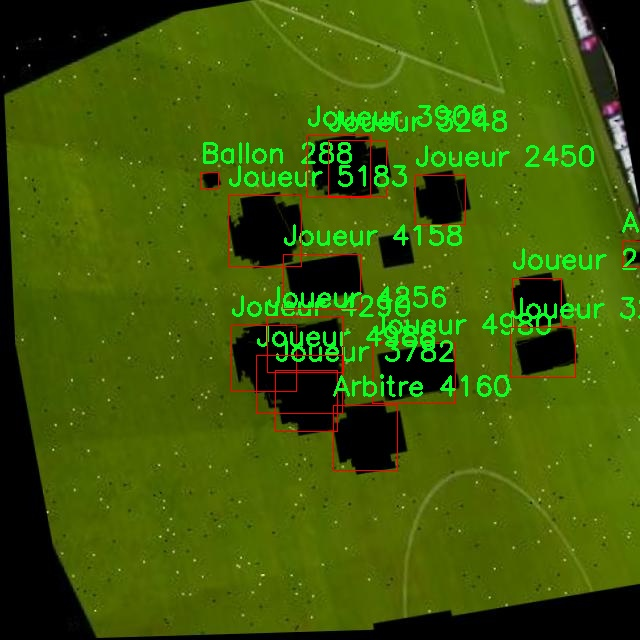
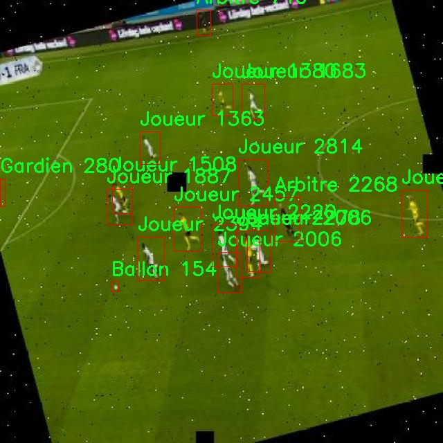
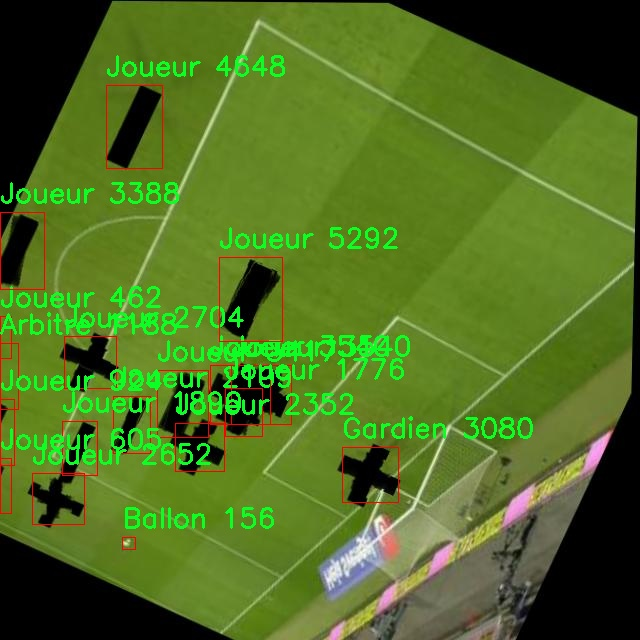
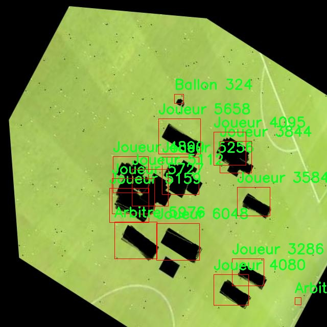
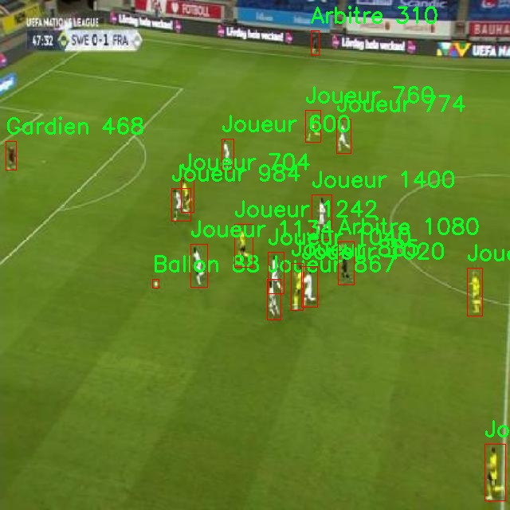

# 足球比赛场景检测检测系统源码分享
 # [一条龙教学YOLOV8标注好的数据集一键训练_70+全套改进创新点发刊_Web前端展示]

### 1.研究背景与意义

项目参考[AAAI Association for the Advancement of Artificial Intelligence](https://gitee.com/qunmasj/projects)

项目来源[AACV Association for the Advancement of Computer Vision](https://kdocs.cn/l/cszuIiCKVNis)

研究背景与意义

随着计算机视觉技术的迅猛发展，物体检测在各个领域的应用日益广泛，尤其是在体育赛事分析中，准确、实时地识别和跟踪场景中的关键元素对于提升比赛的观赏性和分析的深度具有重要意义。足球作为全球最受欢迎的运动之一，其比赛场景的检测和分析不仅能够为教练和运动员提供战术支持，还能为观众提供更为丰富的观看体验。传统的足球比赛分析方法多依赖于人工观察和记录，效率低下且容易受到主观因素的影响。因此，基于深度学习的自动化检测系统应运而生，成为提升比赛分析效率的重要工具。

在众多物体检测算法中，YOLO（You Only Look Once）系列因其高效的实时检测能力而受到广泛关注。YOLOv8作为该系列的最新版本，结合了更为先进的网络结构和训练策略，展现出更强的检测精度和速度。然而，针对特定场景（如足球比赛）的检测任务，YOLOv8仍存在一定的局限性。为此，本文提出基于改进YOLOv8的足球比赛场景检测系统，旨在通过优化模型结构和训练策略，提高对足球比赛中关键元素的检测精度和实时性。

本研究所使用的数据集包含3300张图像，涵盖了8个类别，包括裁判（Arbitre）、足球（Ballon）、守门员（Gardien）和球员（Joueur）等。这些类别不仅是足球比赛中不可或缺的元素，还代表了比赛进行中的重要角色和物体。通过对这些类别的有效检测，系统能够实时捕捉比赛动态，为战术分析和观众体验提供支持。数据集的多样性和丰富性为模型的训练提供了坚实的基础，使得模型能够在不同的比赛场景中表现出良好的泛化能力。

此外，改进YOLOv8的足球比赛场景检测系统的研究意义还体现在以下几个方面：首先，通过提高检测精度，可以为教练团队提供更为准确的战术分析依据，帮助他们在比赛中做出更为科学的决策。其次，实时检测系统能够为赛事转播提供更多的视角和信息，增强观众的观看体验。最后，该系统的成功应用还可以为其他体育项目的场景检测提供借鉴，推动计算机视觉技术在体育领域的进一步发展。

综上所述，基于改进YOLOv8的足球比赛场景检测系统不仅具有重要的学术价值，也具备广泛的应用前景。通过本研究的深入探索，期望能够为足球比赛的智能分析提供新的思路和方法，推动体育科技的进步与发展。

### 2.图片演示







##### 注意：由于此博客编辑较早，上面“2.图片演示”和“3.视频演示”展示的系统图片或者视频可能为老版本，新版本在老版本的基础上升级如下：（实际效果以升级的新版本为准）

  （1）适配了YOLOV8的“目标检测”模型和“实例分割”模型，通过加载相应的权重（.pt）文件即可自适应加载模型。

  （2）支持“图片识别”、“视频识别”、“摄像头实时识别”三种识别模式。

  （3）支持“图片识别”、“视频识别”、“摄像头实时识别”三种识别结果保存导出，解决手动导出（容易卡顿出现爆内存）存在的问题，识别完自动保存结果并导出到tempDir中。

  （4）支持Web前端系统中的标题、背景图等自定义修改，后面提供修改教程。

  另外本项目提供训练的数据集和训练教程,暂不提供权重文件（best.pt）,需要您按照教程进行训练后实现图片演示和Web前端界面演示的效果。

### 3.视频演示

[3.1 视频演示](https://www.bilibili.com/video/BV1bqszeEESX/)

### 4.数据集信息展示

##### 4.1 本项目数据集详细数据（类别数＆类别名）

nc: 4
names: ['Arbitre', 'Ballon', 'Gardien', 'Joueur']


##### 4.2 本项目数据集信息介绍

数据集信息展示

在本研究中，我们采用了名为“soccer”的数据集，以改进YOLOv8在足球比赛场景中的检测性能。该数据集专门针对足球比赛的特定场景进行设计，旨在提高模型对不同角色和物体的识别能力。数据集包含四个主要类别，分别是“Arbitre”（裁判）、“Ballon”（足球）、“Gardien”（守门员）和“Joueur”（球员）。这些类别的选择反映了足球比赛中最为关键的元素，使得模型能够在复杂的比赛环境中准确识别和定位。

“soccer”数据集的构建考虑到了足球比赛的多样性和动态性。数据集中包含了来自不同比赛和场地的图像，涵盖了各种天气条件和时间段。这种多样性确保了模型在训练过程中能够接触到丰富的场景变化，从而提高其在实际应用中的鲁棒性。例如，裁判的着装可能因比赛级别和地区而异，而球员的服装和球场的背景也会随之变化。这些因素都被纳入数据集的设计中，以确保模型在不同环境下的有效性。

在数据集的标注过程中，我们采用了精确的边界框和类别标签，为每一帧图像中的目标提供了详细的信息。这种标注方式不仅提高了模型的训练效率，也为后续的评估和优化提供了可靠的基础。每个类别的标注都经过严格审核，以确保数据的准确性和一致性。此外，数据集还包括了不同视角和距离下的图像，使得模型能够学习到不同目标在各种情况下的特征表现。

在数据集的规模方面，“soccer”数据集涵盖了大量的图像，确保了模型能够获得足够的训练样本。通过对图像进行多样化处理，包括旋转、缩放和颜色调整，我们进一步增强了数据集的有效性。这种数据增强技术不仅提升了模型的泛化能力，还有效减少了过拟合的风险，使得YOLOv8在面对未见过的场景时依然能够保持较高的检测精度。

在训练过程中，我们将数据集划分为训练集、验证集和测试集，以便于对模型的性能进行全面评估。训练集用于模型的学习，验证集用于调优超参数，而测试集则用于最终的性能评估。通过这种方式，我们能够确保模型在真实场景中的表现能够达到预期目标。

总之，“soccer”数据集为改进YOLOv8的足球比赛场景检测系统提供了坚实的基础。通过对裁判、足球、守门员和球员等关键元素的精确标注和丰富样本的提供，我们相信该数据集将显著提升模型在复杂动态环境中的检测能力，为未来的足球比赛分析和相关应用奠定基础。











### 5.全套项目环境部署视频教程（零基础手把手教学）

[5.1 环境部署教程链接（零基础手把手教学）](https://www.ixigua.com/7404473917358506534?logTag=c807d0cbc21c0ef59de5)


[5.2 安装Python虚拟环境创建和依赖库安装视频教程链接（零基础手把手教学）](https://www.ixigua.com/7404474678003106304?logTag=1f1041108cd1f708b01a)

### 6.手把手YOLOV8训练视频教程（零基础小白有手就能学会）

[6.1 手把手YOLOV8训练视频教程（零基础小白有手就能学会）](https://www.ixigua.com/7404477157818401292?logTag=d31a2dfd1983c9668658)

### 7.70+种全套YOLOV8创新点代码加载调参视频教程（一键加载写好的改进模型的配置文件）

[7.1 70+种全套YOLOV8创新点代码加载调参视频教程（一键加载写好的改进模型的配置文件）](https://www.ixigua.com/7404478314661806627?logTag=29066f8288e3f4eea3a4)

### 8.70+种全套YOLOV8创新点原理讲解（非科班也可以轻松写刊发刊，V10版本正在科研待更新）

由于篇幅限制，每个创新点的具体原理讲解就不一一展开，具体见下列网址中的创新点对应子项目的技术原理博客网址【Blog】：


[8.1 70+种全套YOLOV8创新点原理讲解链接](https://gitee.com/qunmasj/good)

### 9.系统功能展示（检测对象为举例，实际内容以本项目数据集为准）

图9.1.系统支持检测结果表格显示

  图9.2.系统支持置信度和IOU阈值手动调节

  图9.3.系统支持自定义加载权重文件best.pt(需要你通过步骤5中训练获得)

  图9.4.系统支持摄像头实时识别

  图9.5.系统支持图片识别

  图9.6.系统支持视频识别

  图9.7.系统支持识别结果文件自动保存

  图9.8.系统支持Excel导出检测结果数据


### 10.原始YOLOV8算法原理

原始YOLOv8算法原理

YOLOv8作为YOLO系列的最新版本，代表了目标检测领域中的一项重要进展。其设计理念在于实现高效、准确的目标检测，适应多种应用场景。YOLOv8的网络结构可以被划分为输入端、主干网络、颈部网络和头部网络四个主要部分，其中每个部分都经过精心设计，以确保模型在性能和计算效率之间取得最佳平衡。

首先，输入端负责将原始图像调整为模型所需的输入尺寸。通过缩放和归一化处理，输入图像被转换为适合网络处理的格式。这一过程不仅确保了数据的一致性，还为后续的特征提取奠定了基础。

接下来，主干网络是YOLOv8的核心部分，负责从输入图像中提取深层特征。YOLOv8采用了CSP（Cross Stage Partial）结构，这种结构将特征提取过程分为两部分，分别进行卷积和连接。这样的设计使得网络能够在保留丰富特征信息的同时，减少计算复杂度。主干网络中的卷积层结合了批归一化和SiLU激活函数，增强了模型的非线性表达能力。此外，YOLOv8引入了C2f模块，这一模块的设计灵感来源于YOLOv7中的E-ELAN结构，通过跨层分支连接来提升梯度流动，进一步改善了特征提取的效果。C2f模块相较于YOLOv5中的C3模块，增加了更多的残差连接，这使得模型在轻量化的基础上，能够获取更加丰富的梯度信息，进而提升检测性能。

在主干网络的末尾，YOLOv8引入了SPPF（Spatial Pyramid Pooling Fast）模块，通过三个最大池化层的组合，处理多尺度特征。这一设计不仅增强了网络的特征抽象能力，还提高了模型的计算速度，使得YOLOv8在实时目标检测中表现出色。

颈部网络则负责将主干网络提取的特征进行多尺度融合。YOLOv8依旧采用了PAN-FPN（Path Aggregation Network - Feature Pyramid Network）结构，这一结构通过自下而上的路径和自上而下的路径结合，能够有效地融合不同尺度的特征图信息。这样的特征融合策略使得YOLOv8在处理小目标和大目标时都能保持较高的检测精度。

在检测阶段，YOLOv8采用了解耦合的检测头结构，将分类和回归任务分开处理。这样的设计使得模型在处理目标检测时能够更加灵活高效，避免了传统方法中分类和回归任务相互干扰的问题。此外，YOLOv8采用了Anchor-Free的检测方式，减少了对预定义锚框的依赖，使得模型在各种场景下都能更好地适应目标的形状和大小变化。

在损失计算方面，YOLOv8使用了BCELoss（Binary Cross Entropy Loss）作为分类损失，DFLLoss（Distance Focal Loss）和CIoULoss（Complete Intersection over Union Loss）作为回归损失。这种多损失函数的设计，旨在提升模型在复杂场景下的检测能力，尤其是在目标密集或重叠的情况下，能够有效降低误检和漏检的概率。

总的来说，YOLOv8在算法设计上融合了多种先进的技术和理念，通过改进网络结构、优化特征提取和融合策略、引入解耦合检测头以及采用多样化的损失函数，展现出强大的目标检测能力。其灵活的模型选择和高效的计算性能，使得YOLOv8在实际应用中具有广泛的适用性，能够满足不同场景的需求。无论是在自动驾驶、安防监控还是工业检测等领域，YOLOv8都展现出了卓越的性能，标志着目标检测技术的又一次飞跃。


### 11.项目核心源码讲解（再也不用担心看不懂代码逻辑）

#### 11.1 code\ultralytics\utils\tuner.py

以下是对代码的核心部分进行分析和详细注释的结果：

```python
# Ultralytics YOLO 🚀, AGPL-3.0 license

import subprocess  # 用于执行系统命令

from ultralytics.cfg import TASK2DATA, TASK2METRIC, get_save_dir  # 导入配置相关的工具
from ultralytics.utils import DEFAULT_CFG, DEFAULT_CFG_DICT, LOGGER, NUM_THREADS  # 导入默认配置和日志工具

def run_ray_tune(
    model, space: dict = None, grace_period: int = 10, gpu_per_trial: int = None, max_samples: int = 10, **train_args
):
    """
    使用 Ray Tune 进行超参数调优。

    参数:
        model (YOLO): 要进行调优的模型。
        space (dict, optional): 超参数搜索空间。默认为 None。
        grace_period (int, optional): ASHA 调度器的宽限期（以 epochs 为单位）。默认为 10。
        gpu_per_trial (int, optional): 每个试验分配的 GPU 数量。默认为 None。
        max_samples (int, optional): 最大试验次数。默认为 10。
        train_args (dict, optional): 传递给 `train()` 方法的附加参数。默认为 {}。

    返回:
        (dict): 包含超参数搜索结果的字典。
    """

    LOGGER.info("💡 Learn about RayTune at https://docs.ultralytics.com/integrations/ray-tune")
    
    # 如果没有提供 train_args，则初始化为空字典
    if train_args is None:
        train_args = {}

    # 尝试安装 Ray Tune
    try:
        subprocess.run("pip install ray[tune]".split(), check=True)

        import ray  # 导入 Ray 库
        from ray import tune  # 导入 Ray Tune
        from ray.air import RunConfig  # 导入运行配置
        from ray.air.integrations.wandb import WandbLoggerCallback  # 导入 Weights & Biases 日志回调
        from ray.tune.schedulers import ASHAScheduler  # 导入 ASHA 调度器
    except ImportError:
        raise ModuleNotFoundError('调优超参数需要 Ray Tune. 使用: pip install "ray[tune]" 安装')

    # 尝试导入 wandb 库
    try:
        import wandb
        assert hasattr(wandb, "__version__")  # 确保 wandb 有版本属性
    except (ImportError, AssertionError):
        wandb = False  # 如果导入失败，则将 wandb 设置为 False

    # 定义默认的超参数搜索空间
    default_space = {
        "lr0": tune.uniform(1e-5, 1e-1),  # 初始学习率
        "lrf": tune.uniform(0.01, 1.0),  # 最终学习率调整因子
        "momentum": tune.uniform(0.6, 0.98),  # 动量
        "weight_decay": tune.uniform(0.0, 0.001),  # 权重衰减
        "warmup_epochs": tune.uniform(0.0, 5.0),  # 预热 epochs
        "warmup_momentum": tune.uniform(0.0, 0.95),  # 预热初始动量
        "box": tune.uniform(0.02, 0.2),  # 边框损失增益
        "cls": tune.uniform(0.2, 4.0),  # 分类损失增益
        # 其他数据增强参数...
    }

    # 将模型放入 Ray 存储中
    task = model.task  # 获取模型任务
    model_in_store = ray.put(model)  # 将模型放入 Ray 存储

    def _tune(config):
        """
        使用指定的超参数和附加参数训练 YOLO 模型。

        参数:
            config (dict): 用于训练的超参数字典。

        返回:
            None.
        """
        model_to_train = ray.get(model_in_store)  # 从 Ray 存储中获取模型
        model_to_train.reset_callbacks()  # 重置回调
        config.update(train_args)  # 更新配置
        results = model_to_train.train(**config)  # 训练模型
        return results.results_dict  # 返回结果字典

    # 获取搜索空间
    if not space:
        space = default_space  # 如果没有提供搜索空间，则使用默认空间
        LOGGER.warning("WARNING ⚠️ search space not provided, using default search space.")

    # 获取数据集
    data = train_args.get("data", TASK2DATA[task])  # 从 train_args 中获取数据集
    space["data"] = data  # 将数据集添加到搜索空间
    if "data" not in train_args:
        LOGGER.warning(f'WARNING ⚠️ data not provided, using default "data={data}".')

    # 定义可训练函数并分配资源
    trainable_with_resources = tune.with_resources(_tune, {"cpu": NUM_THREADS, "gpu": gpu_per_trial or 0})

    # 定义 ASHA 调度器
    asha_scheduler = ASHAScheduler(
        time_attr="epoch",  # 时间属性
        metric=TASK2METRIC[task],  # 评估指标
        mode="max",  # 最大化指标
        max_t=train_args.get("epochs") or DEFAULT_CFG_DICT["epochs"] or 100,  # 最大训练 epochs
        grace_period=grace_period,  # 宽限期
        reduction_factor=3,  # 减少因子
    )

    # 定义超参数搜索的回调
    tuner_callbacks = [WandbLoggerCallback(project="YOLOv8-tune")] if wandb else []

    # 创建 Ray Tune 超参数搜索调优器
    tune_dir = get_save_dir(DEFAULT_CFG, name="tune").resolve()  # 获取保存目录
    tune_dir.mkdir(parents=True, exist_ok=True)  # 创建目录
    tuner = tune.Tuner(
        trainable_with_resources,
        param_space=space,
        tune_config=tune.TuneConfig(scheduler=asha_scheduler, num_samples=max_samples),  # 调整配置
        run_config=RunConfig(callbacks=tuner_callbacks, storage_path=tune_dir),  # 运行配置
    )

    # 运行超参数搜索
    tuner.fit()

    # 返回超参数搜索的结果
    return tuner.get_results()
```

### 代码分析总结
- 该代码主要用于使用 Ray Tune 进行 YOLO 模型的超参数调优。
- 通过定义超参数搜索空间和训练函数，结合 ASHA 调度器来优化模型性能。
- 代码中使用了 Ray 和 Weights & Biases (wandb) 来支持分布式训练和实验管理。
- 重要的部分包括超参数的定义、模型的训练和结果的获取。

这个文件是Ultralytics YOLO项目中的一个模块，主要用于超参数调优。它使用Ray Tune库来实现这一功能，允许用户在训练YOLO模型时自动搜索最佳的超参数配置。

文件首先导入了一些必要的模块，包括`subprocess`用于执行命令行操作，以及从`ultralytics.cfg`和`ultralytics.utils`中导入了一些配置和工具函数。接着定义了一个名为`run_ray_tune`的函数，该函数接收多个参数，包括模型、超参数搜索空间、训练的额外参数等。

在函数内部，首先通过日志记录器输出Ray Tune的学习链接。接着，如果没有提供训练参数，则初始化为空字典。函数尝试安装Ray Tune库，如果未安装，则抛出一个模块未找到的异常。随后，导入Ray及其相关模块，包括调度器和Wandb日志记录器。

函数定义了一个默认的超参数搜索空间，其中包括学习率、动量、权重衰减、图像增强参数等。这些参数都是模型训练中常用的超参数，用户可以根据需要自定义搜索空间。

接下来，模型被放入Ray的存储中，以便在调优过程中使用。定义了一个内部函数`_tune`，该函数负责使用指定的超参数训练YOLO模型，并返回训练结果。

函数接着检查是否提供了超参数搜索空间，如果没有，则使用默认的搜索空间，并记录警告信息。同时，从训练参数中获取数据集的信息，如果未提供数据集，则使用默认值并记录警告。

然后，定义了一个可训练的函数，并为其分配资源，包括CPU和GPU。接着，定义了一个ASHAScheduler调度器，用于管理超参数搜索的过程，设置了最大训练轮数和其他参数。

如果用户使用了Wandb进行实验跟踪，则添加相应的回调函数。然后，创建Ray Tune的超参数搜索调优器，并指定参数空间、调度器、运行配置等。

最后，调用`tuner.fit()`开始超参数搜索，并返回搜索结果。这些结果包含了不同超参数配置下的训练表现，用户可以根据这些结果选择最佳的超参数组合。整体上，这个模块为YOLO模型的训练提供了灵活的超参数调优机制，能够帮助用户更高效地找到最佳的训练配置。

#### 11.2 code\ultralytics\trackers\__init__.py

以下是代码中最核心的部分，并附上详细的中文注释：

```python
# 导入所需的跟踪器类
from .bot_sort import BOTSORT  # 导入BOTSORT类，用于目标跟踪
from .byte_tracker import BYTETracker  # 导入BYTETracker类，用于另一种目标跟踪
from .track import register_tracker  # 导入注册跟踪器的函数

# 定义可供外部使用的模块成员
__all__ = "register_tracker", "BOTSORT", "BYTETracker"  # 允许简化导入，指定外部可访问的类和函数
```

### 注释说明：
1. **导入部分**：
   - `from .bot_sort import BOTSORT`：从当前包中导入 `BOTSORT` 类，`BOTSORT` 是一种目标跟踪算法，通常用于处理视频流中的目标检测和跟踪。
   - `from .byte_tracker import BYTETracker`：从当前包中导入 `BYTETracker` 类，`BYTETracker` 是另一种目标跟踪算法，具有不同的实现和性能特点。
   - `from .track import register_tracker`：从当前包中导入 `register_tracker` 函数，用于注册不同的跟踪器，以便在需要时可以方便地使用。

2. **`__all__` 的定义**：
   - `__all__` 是一个特殊的变量，用于定义当使用 `from module import *` 语句时，哪些名称是可以被导入的。在这里，指定了 `register_tracker`、`BOTSORT` 和 `BYTETracker`，这意味着这三个成员是该模块的公共接口，其他模块可以直接使用它们。

这个程序文件是一个Python模块的初始化文件，位于`code/ultralytics/trackers/`目录下。文件的开头有一个注释，指出这个项目是Ultralytics YOLO的一部分，并且使用AGPL-3.0许可证。这表明该代码是开源的，用户可以自由使用和修改，但需要遵循相应的许可证条款。

接下来，文件通过相对导入的方式引入了三个组件：`BOTSORT`、`BYTETracker`和`register_tracker`。这些组件分别来自于同一目录下的`bot_sort.py`、`byte_tracker.py`和`track.py`文件。`BOTSORT`和`BYTETracker`可能是用于目标跟踪的不同算法或实现，而`register_tracker`则可能是一个用于注册这些跟踪器的函数。

最后，`__all__`变量被定义为一个包含字符串的元组，列出了该模块公开的接口。这意味着当使用`from module import *`语句时，只会导入`register_tracker`、`BOTSORT`和`BYTETracker`这三个名称。这种做法有助于控制模块的公共接口，避免不必要的名称污染，提高代码的可读性和可维护性。

#### 11.3 ui.py

以下是代码中最核心的部分，并附上详细的中文注释：

```python
import sys
import subprocess

def run_script(script_path):
    """
    使用当前 Python 环境运行指定的脚本。

    Args:
        script_path (str): 要运行的脚本路径

    Returns:
        None
    """
    # 获取当前 Python 解释器的路径
    python_path = sys.executable

    # 构建运行命令，使用 streamlit 运行指定的脚本
    command = f'"{python_path}" -m streamlit run "{script_path}"'

    # 执行命令，并等待其完成
    result = subprocess.run(command, shell=True)
    
    # 检查命令执行的返回码，如果不为0则表示出错
    if result.returncode != 0:
        print("脚本运行出错。")

# 主程序入口
if __name__ == "__main__":
    # 指定要运行的脚本路径
    script_path = "web.py"  # 这里可以替换为实际的脚本路径

    # 调用函数运行指定的脚本
    run_script(script_path)
```

### 注释说明：
1. **导入模块**：
   - `sys`：用于访问与 Python 解释器相关的变量和函数。
   - `subprocess`：用于执行外部命令。

2. **`run_script` 函数**：
   - 该函数接受一个脚本路径作为参数，并使用当前 Python 环境来运行该脚本。
   - 使用 `sys.executable` 获取当前 Python 解释器的路径，以确保使用正确的 Python 环境。
   - 构建命令字符串，使用 `streamlit` 模块运行指定的脚本。
   - 使用 `subprocess.run` 执行命令，并通过 `shell=True` 允许在 shell 中执行。
   - 检查命令的返回码，如果返回码不为0，表示脚本运行出错，并打印错误信息。

3. **主程序入口**：
   - 使用 `if __name__ == "__main__":` 确保只有在直接运行该脚本时才会执行以下代码。
   - 指定要运行的脚本路径，并调用 `run_script` 函数来执行该脚本。

这个程序文件的主要功能是通过当前的 Python 环境来运行一个指定的脚本，具体是一个名为 `web.py` 的文件。首先，程序导入了必要的模块，包括 `sys`、`os` 和 `subprocess`，这些模块分别用于获取系统信息、处理文件路径和执行外部命令。

在程序中定义了一个名为 `run_script` 的函数，该函数接受一个参数 `script_path`，表示要运行的脚本的路径。函数内部首先获取当前 Python 解释器的路径，接着构建一个命令字符串，该命令使用 `streamlit` 来运行指定的脚本。`streamlit` 是一个用于构建数据应用的库。

然后，程序使用 `subprocess.run` 方法来执行构建好的命令。这个方法会在新的 shell 中运行命令，并返回一个结果对象。通过检查 `result.returncode`，程序可以判断脚本是否成功运行。如果返回码不为零，说明脚本运行出错，程序会输出一条错误信息。

在文件的最后部分，使用 `if __name__ == "__main__":` 语句来确保只有在直接运行该文件时才会执行下面的代码。此处指定了要运行的脚本路径 `web.py`，并调用 `run_script` 函数来执行这个脚本。

总的来说，这个程序的功能是为运行 `web.py` 提供一个简便的入口，确保在当前 Python 环境中通过 `streamlit` 来启动该脚本。

#### 11.4 70+种YOLOv8算法改进源码大全和调试加载训练教程（非必要）\ultralytics\data\__init__.py

```python
# Ultralytics YOLO 🚀, AGPL-3.0 license

# 从当前模块导入基础数据集类
from .base import BaseDataset
# 从构建模块导入构建数据加载器、构建YOLO数据集和加载推理源的函数
from .build import build_dataloader, build_yolo_dataset, load_inference_source
# 从数据集模块导入分类数据集、语义数据集和YOLO数据集类
from .dataset import ClassificationDataset, SemanticDataset, YOLODataset

# 定义模块的公共接口，允许用户从此模块导入这些类和函数
__all__ = ('BaseDataset', 'ClassificationDataset', 'SemanticDataset', 'YOLODataset', 
           'build_yolo_dataset', 'build_dataloader', 'load_inference_source')
```

### 代码注释说明：
1. **模块导入**：
   - 代码首先导入了几个重要的类和函数，这些是实现YOLO（You Only Look Once）目标检测算法所需的基础组件。
   - `BaseDataset` 是所有数据集的基类，提供了基本的数据处理功能。
   - `build_dataloader` 用于构建数据加载器，负责将数据集分批次加载，以便于训练和推理。
   - `build_yolo_dataset` 用于构建特定于YOLO的训练数据集，处理YOLO特有的数据格式。
   - `load_inference_source` 用于加载推理时所需的数据源。

2. **数据集类**：
   - `ClassificationDataset` 是用于分类任务的数据集类。
   - `SemanticDataset` 是用于语义分割任务的数据集类。
   - `YOLODataset` 是专门为YOLO目标检测设计的数据集类。

3. **公共接口**：
   - `__all__` 变量定义了模块的公共接口，允许用户在使用 `from module import *` 时只导入这些指定的类和函数。这是一种良好的封装方式，有助于维护模块的清晰性和可用性。

这个程序文件是Ultralytics YOLO（You Only Look Once）算法的一部分，主要涉及数据集的管理和加载。文件中首先声明了该项目的许可证类型为AGPL-3.0，表明其开源性质。

接下来，文件通过相对导入的方式引入了几个模块。首先是`BaseDataset`，这是一个基础数据集类，可能提供了一些通用的方法和属性，供其他数据集类继承和使用。然后引入了三个构建和加载数据集的函数：`build_dataloader`、`build_yolo_dataset`和`load_inference_source`，这些函数的作用是帮助用户创建数据加载器和YOLO数据集，方便进行模型训练和推理。

此外，文件还引入了三个具体的数据集类：`ClassificationDataset`、`SemanticDataset`和`YOLODataset`。这些类分别用于处理不同类型的数据集，`ClassificationDataset`可能用于分类任务，`SemanticDataset`用于语义分割任务，而`YOLODataset`则专门为YOLO算法设计，处理目标检测任务。

最后，`__all__`变量定义了模块的公共接口，列出了可以被外部导入的类和函数。这意味着，当其他模块使用`from .data import *`时，只会导入这些指定的类和函数，从而控制了模块的可见性和使用范围。

总的来说，这个文件的主要功能是组织和提供与数据集相关的类和函数，为YOLO算法的训练和推理提供必要的数据支持。

#### 11.5 70+种YOLOv8算法改进源码大全和调试加载训练教程（非必要）\ultralytics\utils\benchmarks.py

以下是代码中最核心的部分，并附上详细的中文注释：

```python
import time
import pandas as pd
from ultralytics import YOLO
from ultralytics.utils import select_device, check_yolo, file_size, export_formats, TASK2DATA, TASK2METRIC, ASSETS, LOGGER

def benchmark(model='yolov8n.pt', data=None, imgsz=160, half=False, int8=False, device='cpu', verbose=False):
    """
    基准测试 YOLO 模型在不同格式下的速度和准确性。

    参数:
        model (str | Path | optional): 模型文件或目录的路径，默认为 'yolov8n.pt'。
        data (str, optional): 用于评估的数据集，默认为 None。
        imgsz (int, optional): 基准测试的图像大小，默认为 160。
        half (bool, optional): 如果为 True，则使用半精度模型，默认为 False。
        int8 (bool, optional): 如果为 True，则使用 int8 精度模型，默认为 False。
        device (str, optional): 运行基准测试的设备，可以是 'cpu' 或 'cuda'，默认为 'cpu'。
        verbose (bool | float | optional): 如果为 True 或浮点数，则在给定指标下断言基准测试通过，默认为 False。

    返回:
        df (pandas.DataFrame): 包含每种格式的基准测试结果的 pandas DataFrame，包括文件大小、指标和推理时间。
    """

    # 设置 pandas 显示选项
    pd.options.display.max_columns = 10
    pd.options.display.width = 120

    # 选择设备
    device = select_device(device, verbose=False)

    # 加载模型
    model = YOLO(model) if isinstance(model, (str, Path)) else model

    results = []  # 存储结果的列表
    start_time = time.time()  # 记录开始时间

    # 遍历导出格式
    for i, (name, format, suffix, cpu, gpu) in export_formats().iterrows():
        emoji, filename = '❌', None  # 默认导出状态为失败
        try:
            # 检查导出格式的兼容性
            if i == 9: assert platform.system() == 'Linux', 'Edge TPU export only supported on Linux'
            if i == 10: assert platform.system() in ['Darwin', 'Linux'], 'TF.js export only supported on macOS and Linux'
            if i == 11: assert sys.version_info < (3, 11), 'PaddlePaddle export only supported on Python<=3.10'
            if 'cpu' in device.type: assert cpu, 'inference not supported on CPU'
            if 'cuda' in device.type: assert gpu, 'inference not supported on GPU'

            # 导出模型
            if format == '-':
                filename = model.ckpt_path or model.cfg  # PyTorch 格式
                exported_model = model
            else:
                filename = model.export(imgsz=imgsz, format=format, half=half, int8=int8, device=device, verbose=False)
                exported_model = YOLO(filename, task=model.task)
                assert suffix in str(filename), 'export failed'
            emoji = '✅'  # 导出成功

            # 进行推理
            exported_model.predict(ASSETS / 'bus.jpg', imgsz=imgsz, device=device, half=half)

            # 验证模型
            data = data or TASK2DATA[model.task]  # 获取数据集
            key = TASK2METRIC[model.task]  # 获取评估指标
            results_dict = exported_model.val(data=data, batch=1, imgsz=imgsz, plots=False, device=device, half=half, int8=int8, verbose=False)
            metric, speed = results_dict.results_dict[key], results_dict.speed['inference']
            results.append([name, '✅', round(file_size(filename), 1), round(metric, 4), round(speed, 2)])
        except Exception as e:
            LOGGER.warning(f'ERROR ❌️ Benchmark failure for {name}: {e}')
            results.append([name, emoji, round(file_size(filename), 1), None, None])  # 记录失败信息

    # 打印结果
    check_yolo(device=device)  # 打印系统信息
    df = pd.DataFrame(results, columns=['Format', 'Status❔', 'Size (MB)', key, 'Inference time (ms/im)'])

    # 记录基准测试完成的信息
    name = model.ckpt_path.name
    log_message = f'\nBenchmarks complete for {name} at imgsz={imgsz} ({time.time() - start_time:.2f}s)\n{df}\n'
    LOGGER.info(log_message)

    # 将结果写入日志文件
    with open('benchmarks.log', 'a', errors='ignore', encoding='utf-8') as f:
        f.write(log_message)

    return df  # 返回结果 DataFrame
```

### 代码核心部分解释：
1. **导入必要的库**：引入时间、数据处理和 YOLO 模型相关的库。
2. **benchmark 函数**：这是进行基准测试的主要函数，接受多个参数以控制测试的行为。
3. **设备选择**：使用 `select_device` 函数选择运行基准测试的设备（CPU 或 GPU）。
4. **模型加载**：根据传入的模型路径加载 YOLO 模型。
5. **导出格式循环**：遍历支持的导出格式，进行模型导出、推理和验证。
6. **异常处理**：在导出和推理过程中捕获异常，并记录失败信息。
7. **结果记录**：将每种格式的测试结果存储在 DataFrame 中，并输出到日志文件。

通过这些步骤，代码能够有效地评估 YOLO 模型在不同格式下的性能表现。

这个程序文件是一个用于基准测试YOLO模型的工具，主要用于评估不同格式的YOLO模型在速度和准确性方面的表现。文件中包含了两个主要的类和多个函数，下面是对其功能和结构的详细说明。

首先，文件的开头部分是一些文档字符串，描述了如何使用这个基准测试工具。用户可以通过导入`ProfileModels`和`benchmark`函数来进行模型的基准测试。文档中列出了支持的模型格式，包括PyTorch、ONNX、TensorRT等，用户可以根据需要选择不同的格式进行测试。

接下来，`benchmark`函数是该文件的核心功能之一。它接受多个参数，包括模型路径、数据集、图像大小、设备类型等。该函数的主要目的是对指定的YOLO模型进行基准测试，计算模型在不同格式下的推理时间和准确性。函数内部首先会选择设备（CPU或GPU），然后通过循环遍历不同的导出格式，对每种格式进行模型导出和推理。最终，结果会以`pandas DataFrame`的形式返回，包含每种格式的文件大小、准确性指标和推理时间等信息。

`ProfileModels`类则是用于对多个模型进行性能分析的工具。它可以接受多个模型路径，并通过`profile`方法对这些模型进行基准测试。该类内部定义了一些属性，如定时运行次数、预热运行次数、最小运行时间和图像大小等。`profile`方法会遍历指定的模型文件，导出ONNX和TensorRT格式的模型，并对其进行性能分析，最终生成一个包含各个模型性能的表格。

在性能分析的过程中，类中还定义了一些辅助方法，如`get_files`用于获取模型文件路径，`profile_tensorrt_model`和`profile_onnx_model`分别用于分析TensorRT和ONNX模型的性能。这些方法会执行多次推理并计算平均时间和标准差，以确保结果的可靠性。

此外，文件中还包含了一些错误处理和日志记录的功能，以便在基准测试过程中能够捕捉到潜在的问题并进行记录。

总体而言，这个程序文件提供了一个全面的工具，用于评估YOLO模型在不同格式下的性能，适合研究人员和开发者在模型优化和部署时使用。通过基准测试，用户可以获得关于模型速度和准确性的详细信息，从而做出更好的决策。

#### 11.6 train.py

以下是经过简化和注释的核心代码部分：

```python
import random
import numpy as np
import torch.nn as nn
from ultralytics.data import build_dataloader, build_yolo_dataset
from ultralytics.engine.trainer import BaseTrainer
from ultralytics.models import yolo
from ultralytics.nn.tasks import DetectionModel
from ultralytics.utils import LOGGER, RANK
from ultralytics.utils.torch_utils import de_parallel, torch_distributed_zero_first

class DetectionTrainer(BaseTrainer):
    """
    DetectionTrainer类用于基于YOLO模型进行目标检测的训练。
    """

    def build_dataset(self, img_path, mode="train", batch=None):
        """
        构建YOLO数据集。

        参数:
            img_path (str): 包含图像的文件夹路径。
            mode (str): 模式，可以是'train'或'val'，用于自定义不同的增强方法。
            batch (int, optional): 批次大小，默认为None。
        """
        gs = max(int(de_parallel(self.model).stride.max() if self.model else 0), 32)  # 获取模型的最大步幅
        return build_yolo_dataset(self.args, img_path, batch, self.data, mode=mode, rect=mode == "val", stride=gs)

    def get_dataloader(self, dataset_path, batch_size=16, rank=0, mode="train"):
        """构建并返回数据加载器。"""
        assert mode in ["train", "val"]  # 确保模式有效
        with torch_distributed_zero_first(rank):  # 仅在DDP中初始化数据集
            dataset = self.build_dataset(dataset_path, mode, batch_size)  # 构建数据集
        shuffle = mode == "train"  # 训练模式下打乱数据
        workers = self.args.workers if mode == "train" else self.args.workers * 2  # 设置工作线程数
        return build_dataloader(dataset, batch_size, workers, shuffle, rank)  # 返回数据加载器

    def preprocess_batch(self, batch):
        """对图像批次进行预处理，包括缩放和转换为浮点数。"""
        batch["img"] = batch["img"].to(self.device, non_blocking=True).float() / 255  # 将图像转换为浮点数并归一化
        if self.args.multi_scale:  # 如果启用多尺度
            imgs = batch["img"]
            sz = (
                random.randrange(self.args.imgsz * 0.5, self.args.imgsz * 1.5 + self.stride)
                // self.stride
                * self.stride
            )  # 随机选择新的图像大小
            sf = sz / max(imgs.shape[2:])  # 计算缩放因子
            if sf != 1:  # 如果需要缩放
                ns = [
                    math.ceil(x * sf / self.stride) * self.stride for x in imgs.shape[2:]
                ]  # 计算新的形状
                imgs = nn.functional.interpolate(imgs, size=ns, mode="bilinear", align_corners=False)  # 进行插值缩放
            batch["img"] = imgs  # 更新批次图像
        return batch

    def get_model(self, cfg=None, weights=None, verbose=True):
        """返回YOLO目标检测模型。"""
        model = DetectionModel(cfg, nc=self.data["nc"], verbose=verbose and RANK == -1)  # 创建检测模型
        if weights:
            model.load(weights)  # 加载权重
        return model

    def plot_training_samples(self, batch, ni):
        """绘制训练样本及其注释。"""
        plot_images(
            images=batch["img"],
            batch_idx=batch["batch_idx"],
            cls=batch["cls"].squeeze(-1),
            bboxes=batch["bboxes"],
            paths=batch["im_file"],
            fname=self.save_dir / f"train_batch{ni}.jpg",
            on_plot=self.on_plot,
        )

    def plot_metrics(self):
        """从CSV文件中绘制指标。"""
        plot_results(file=self.csv, on_plot=self.on_plot)  # 保存结果图
```

### 代码说明：
1. **DetectionTrainer类**：该类继承自`BaseTrainer`，用于处理YOLO模型的训练过程。
2. **build_dataset方法**：根据给定的图像路径和模式构建YOLO数据集，支持训练和验证模式。
3. **get_dataloader方法**：构建数据加载器，确保在分布式训练中只初始化一次数据集。
4. **preprocess_batch方法**：对输入的图像批次进行预处理，包括归一化和多尺度调整。
5. **get_model方法**：返回一个YOLO目标检测模型，并可选择加载预训练权重。
6. **plot_training_samples方法**：绘制训练样本及其对应的标签，便于可视化训练效果。
7. **plot_metrics方法**：从CSV文件中提取并绘制训练指标，以便于监控训练过程。

这个程序文件 `train.py` 是一个用于训练目标检测模型的脚本，主要基于 YOLO（You Only Look Once）模型。它继承自 `BaseTrainer` 类，提供了一系列用于构建数据集、加载数据、预处理图像、设置模型属性、获取模型、验证模型、记录损失、绘制训练样本和指标等功能。

在程序的开头，导入了一些必要的库和模块，包括数学库、随机数生成库、深度学习框架 PyTorch 的神经网络模块，以及一些来自 `ultralytics` 库的工具函数和类。这些导入的模块为后续的模型训练提供了基础。

`DetectionTrainer` 类中定义了多个方法。`build_dataset` 方法用于构建 YOLO 数据集，接收图像路径、模式（训练或验证）和批量大小作为参数。它会根据模型的步幅计算出合适的大小，并调用 `build_yolo_dataset` 函数来生成数据集。

`get_dataloader` 方法用于构建数据加载器，确保在分布式训练时只初始化一次数据集。它会根据模式选择是否打乱数据，并设置工作线程的数量。这个方法最终返回一个数据加载器，方便后续的训练过程。

`preprocess_batch` 方法负责对图像批次进行预处理，包括将图像缩放到合适的大小并转换为浮点数。它支持多尺度训练，通过随机选择图像大小来增强模型的鲁棒性。

`set_model_attributes` 方法用于设置模型的属性，包括类别数量和类别名称。这些属性是根据数据集的信息来动态调整的。

`get_model` 方法返回一个 YOLO 检测模型，并支持加载预训练权重。`get_validator` 方法返回一个用于验证模型的验证器，能够计算损失并进行模型评估。

`label_loss_items` 方法用于返回带有标签的训练损失字典，便于后续的损失记录和分析。`progress_string` 方法返回一个格式化的字符串，显示训练进度，包括当前的 epoch、GPU 内存使用情况、损失值、实例数量和图像大小等信息。

`plot_training_samples` 方法用于绘制训练样本及其标注，便于可视化训练过程中的数据。`plot_metrics` 方法则用于从 CSV 文件中绘制训练指标，生成结果图像。最后，`plot_training_labels` 方法创建一个带有标签的训练图，显示数据集中所有的边界框和类别信息。

整体来看，这个程序文件为 YOLO 模型的训练提供了全面的支持，涵盖了数据处理、模型训练、验证和结果可视化等多个方面，适合用于目标检测任务的深度学习研究和应用。

### 12.系统整体结构（节选）

### 整体功能和构架概括

该项目是一个基于YOLO（You Only Look Once）算法的目标检测框架，提供了丰富的功能以支持模型的训练、评估、推理和超参数调优。整体架构包括多个模块，每个模块负责特定的功能，如数据处理、模型训练、性能基准测试、跟踪器实现等。项目的设计使得用户能够灵活地使用不同的YOLO模型和数据集，进行模型训练和推理，同时也提供了可视化工具以帮助用户理解和优化模型性能。

### 文件功能整理表

| 文件路径                                                                                   | 功能描述                                                                                       |
|--------------------------------------------------------------------------------------------|-----------------------------------------------------------------------------------------------|
| `code\ultralytics\utils\tuner.py`                                                         | 提供超参数调优功能，使用Ray Tune库自动搜索最佳超参数配置。                                      |
| `code\ultralytics\trackers\__init__.py`                                                  | 初始化跟踪器模块，导入BOTSORT和BYTETracker等跟踪算法。                                         |
| `ui.py`                                                                                   | 提供一个入口脚本，通过streamlit运行指定的web应用。                                            |
| `70+种YOLOv8算法改进源码大全和调试加载训练教程（非必要）\ultralytics\data\__init__.py`  | 管理和加载数据集，提供YOLO数据集和数据加载器的构建功能。                                       |
| `70+种YOLOv8算法改进源码大全和调试加载训练教程（非必要）\ultralytics\utils\benchmarks.py` | 提供模型基准测试工具，评估不同格式YOLO模型的速度和准确性。                                     |
| `train.py`                                                                                | 负责YOLO模型的训练，包含数据处理、模型设置、训练过程和可视化等功能。                           |
| `code\ultralytics\models\fastsam\__init__.py`                                            | 初始化FastSAM模型模块，可能用于快速分割和检测任务。                                            |
| `70+种YOLOv8算法改进源码大全和调试加载训练教程（非必要）\ultralytics\nn\modules\__init__.py` | 初始化神经网络模块，提供不同神经网络层的实现。                                                 |
| `70+种YOLOv8算法改进源码大全和调试加载训练教程（非必要）\ultralytics\trackers\track.py`  | 实现目标跟踪功能，可能包含具体的跟踪算法和逻辑。                                                |
| `70+种YOLOv8算法改进源码大全和调试加载训练教程（非必要）\ultralytics\models\yolo\segment\train.py` | 针对YOLO模型的分割任务提供训练功能。                                                            |
| `code\ultralytics\hub\__init__.py`                                                       | 初始化模型库模块，可能用于模型的加载和管理。                                                  |
| `70+种YOLOv8算法改进源码大全和调试加载训练教程（非必要）\ultralytics\models\rtdetr\model.py` | 实现RTDETR模型，可能用于实时目标检测任务。                                                    |
| `code\ultralytics\data\explorer\gui\__init__.py`                                         | 初始化数据探索工具的GUI模块，提供可视化数据集和模型的功能。                                    |

以上表格总结了各个文件的主要功能，帮助用户快速了解项目的结构和各个模块的作用。

注意：由于此博客编辑较早，上面“11.项目核心源码讲解（再也不用担心看不懂代码逻辑）”中部分代码可能会优化升级，仅供参考学习，完整“训练源码”、“Web前端界面”和“70+种创新点源码”以“13.完整训练+Web前端界面+70+种创新点源码、数据集获取”的内容为准。

### 13.完整训练+Web前端界面+70+种创新点源码、数据集获取


# [下载链接：https://mbd.pub/o/bread/ZpuZlZ9t](https://mbd.pub/o/bread/ZpuZlZ9t)